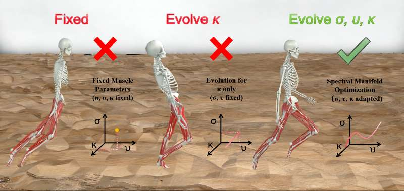
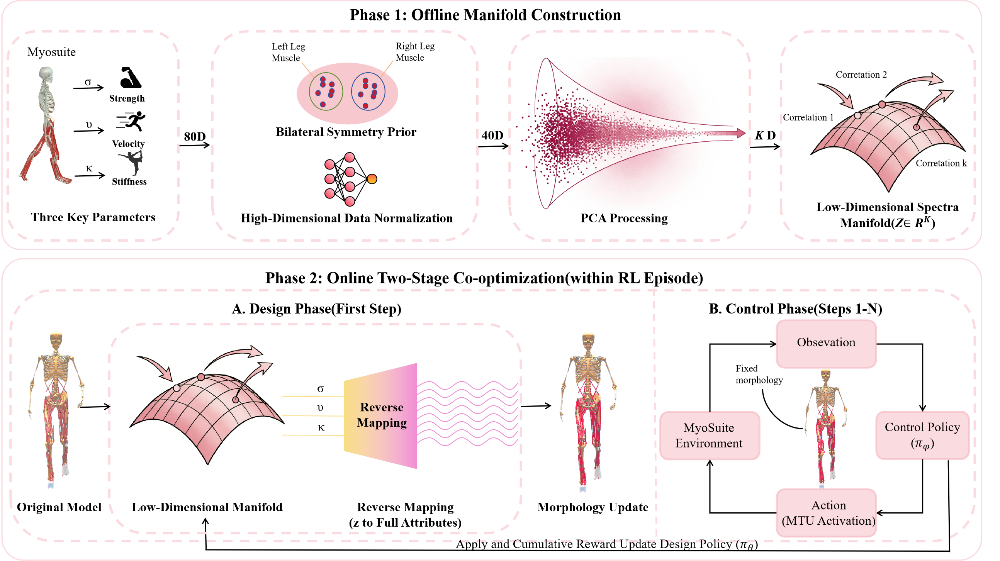

# SpecSyn / SDE for MyoSuite

This repository contains the code used to study **Spectral Synergy Evolution (SDE)** for musculoskeletal morphology-control co-optimization in MyoSuite leg locomotion tasks.

The public version is intentionally **code-only**:
- included: environments, training code, and analysis scripts
- excluded: checkpoints, logs, rollout exports, paper working files, generated synergy bases, and other runtime artifacts

## What This Repo Implements

SDE compresses a high-dimensional muscle design space into a compact latent space, then co-optimizes:
- motor control actions
- muscle property evolution
- terrain-specific locomotion behavior

The current codebase focuses on MyoLeg tasks such as:
- flat walking
- rough terrain walking
- stair walking
- hilly terrain walking

## Concept Overview



## SDE Framework



## Repository Layout

```text
myosuite/
  envs/myo/myobase/        SDE / T2A / terrain task definitions
  agents/                  training, evaluation, and preprocessing utilities
scripts/                   experiment helpers and analysis pipelines
README.md                  public project overview
```

## Installation

Use a clean Python environment first.

```bash
pip install -e .
pip install stable-baselines3 shimmy scikit-learn seaborn
```

If you are using MuJoCo-backed MyoSuite tasks, make sure your MuJoCo runtime and OpenGL backend are configured correctly for your machine.

## Quick Start

### 1. Regenerate the synergy basis

Generated basis files are **not tracked** in this public repository. Before running SDE environments, regenerate them locally:

```bash
python myosuite/agents/extract_synergy.py
```

This will recreate local files such as:
- `myosuite/envs/myo/myobase/synergy_W_basis5.npy`
- `myosuite/envs/myo/myobase/synergy_W_basis_asym.npy`
- related metadata/preprocess files

These outputs are ignored by git and should stay local.

### 2. Launch training

Example:

```bash
python myosuite/agents/hydra_sb3_launcher.py env=myoLegWalkT2Apca1-v0 seed=123
```

### 3. Run validation / analysis

Example utilities in this repo include:
- `scripts/build_biomech_shortlist.py`
- `scripts/build_paper_eval_manifest.py`
- `scripts/run_paper_evaluation_batch.py`
- `scripts/segment_gait_cycles.py`
- `scripts/plot_biomech_composite_figure.py`

## Public Release Policy

The git ignore rules are set up to keep the public repository free of:
- training logs
- checkpoints and model weights
- tensorboard / wandb outputs
- rollout exports and evaluation summaries
- manuscript working directories
- generated `.npy`, `.npz`, `.pkl`, and related basis artifacts

In particular, files like these should remain local:
- `myosuite/envs/myo/myobase/synergy_W_basis5.npy`
- `myosuite/envs/myo/myobase/synergy_W_basis_asym.npy`
- `myosuite/agents/outputs/**`
- `paper/**`

## Notes

- Some scripts in this repository expect locally generated basis files or local experiment outputs.
- The public repository is meant to provide the **method implementation**, not the full private experiment archive.
- If you want a cleaner paper-release version later, it is straightforward to make a second branch that keeps only the final training/evaluation entrypoints.
